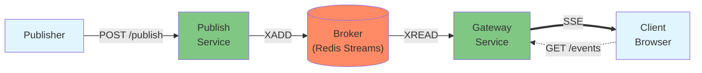

# Conduit

Conduit is the streaming service layer of Sentry's Real-Time Delivery Platform. It provides a scalable and multi-tenant way to deliver real-time data streams to clients.

## Overview

Conduit is built as a Rust workspace consisting of multiple services that work together to provide reliable, high-performance real-time data streaming:

- **Gateway Service**: Handles client connections and delivers real-time data streams via SSE
- **Publish Service**: Accepts data from upstream services and publishes it to the appropriate streams
- **Broker**: Shared library for Redis-based message brokering between services

## Architecture



### Stream Management

Streams are automatically tracked and cleaned up after inactivity (configurable via `CLEANUP_STREAM_IDLE_SEC`, default 300s).
This prevents memory leaks from:

- Crashed or disconnected publishers
- Streams that never reach Phase::End
- Network failures during publishing

A cleanup worker runs periodically (configurable via `CLEANUP_WORKER_INTERVAL_SEC`, default 300s), deleting streams that haven't received any publishes within the inactivity threshold. Active streams (receiving regular publishes) are kept alive indefinitely, supporting long-running or continuous streaming use cases.

**Note:** While streams themselves are unbounded in duration, client connections (on the Gateway service) may have separate timeout limits. This allows clients to reconnect to ongoing streams as needed.

When publishers signal stream completion by sending Phase::End, the stream is expired via Redis TTL. If TTL setting fails, the cleanup worker handles deletion as a fallback.

**Note:** Publishers should implement retry logic for transient failures. The platform is designed for high frequency real-time streaming where retrying is a standard practice.

## Usage Examples

### Publishing a Stream

This example shows how to publish a multi-part stream using the phase system:

#### PublishRequest Fields

The following fields are used in the PublishRequest message ([see full proto definition](https://github.com/getsentry/sentry-protos/tree/main/proto/sentry_protos/conduit)):

| Field              | Type      | Description                                          |
| ------------------ | --------- | ---------------------------------------------------- |
| `channel_id`       | string    | Must match the channel_id in the URL path            |
| `message_id`       | string    | Unique identifier for each message                   |
| `client_timestamp` | Timestamp | When the client created the message                  |
| `phase`            | Phase     | `START`, `DELTA`, `END`, or `ERROR`                  |
| `sequence`         | uint64    | Monotonically increasing number for message ordering |
| `payload`          | Struct    | Your application data (JSON-like)                    |

#### Phase Lifecycle

- **START**: Initiates a new stream. Should be the first message in any stream.
- **DELTA**: Adds incremental data to an ongoing stream. Can have multiple DELTA messages.
- **END**: Completes the stream and signals clients to close their connection. Also triggers a short TTL on the stream data in the broker.
- **ERROR**: Indicates an error occurred during the stream. The stream does NOT automatically terminate.

#### Payload Guidelines

The `payload` field contains your application data and is typically used with DELTA phases. If payload is provided for other phases, they will NOT be processed by the client.

**Size Limits:**

- Maximum message size: 32KB (entire PublishRequest protobuf)
- Messages exceeding this limit receive a 413 Payload Too Large response
- For larger data, split into multiple DELTA messages

The payload must be a valid JSON-like structure in the form of a `google/protobuf/struct.proto`.

#### Example: Streaming "hello, world!"

```http
POST /publish/{org_id}/{channel_id}
Content-Type: application/x-protobuf

PublishRequest {
  channel_id: "97f58c19-ce38-4c6b-8a5b-47f3405691f0"
  message_id: "70a29bd8-e4b6-4875-a478-76ee24ff4ae9"
  phase: START
  sequence: 1
  payload: {}
}
```

```http
POST /publish/{org_id}/{channel_id}
Content-Type: application/x-protobuf

PublishRequest {
  channel_id: "97f58c19-ce38-4c6b-8a5b-47f3405691f0"
  message_id: "1a1b8d8b-68c5-4bbd-bb45-09b4bb01e2af"
  phase: DELTA
  sequence: 2
  payload: {
    "value": "hello,",
  }
}
```

```http
POST /publish/{org_id}/{channel_id}
Content-Type: application/x-protobuf

PublishRequest {
  channel_id: "97f58c19-ce38-4c6b-8a5b-47f3405691f0"
  message_id: "8a5b915d-d434-4f82-a892-584ff9866654"
  phase: DELTA
  sequence: 3
  payload: {
    "value": " world!",
  }
}
```

```http
POST /publish/{org_id}/{channel_id}
Content-Type: application/x-protobuf

PublishRequest {
  channel_id: "97f58c19-ce38-4c6b-8a5b-47f3405691f0"
  message_id: "70a29bd8-e4b6-4875-a478-76ee24ff4ae9"
  phase: END
  sequence: 4
  payload: {}
}
```

### Consuming a Stream

Clients connect to the Gateway service at `GET /events/{org_id}?token=...&channel_id=...` and receive Server-Sent Events:

```json
event: stream
data: {
  "event_type": "stream",
  "message_id": "...",
  "channel_id": "...",
  "sequence": 2,
  "phase": "PHASE_DELTA",
  "payload": {"value": "hello,"}
}
```

The Gateway converts protobuf messages to JSON and sends all fields except client_timestamp.
However, the official client library only forwards payload data for DELTA phase messages to application code.

Consumers can connect at any time during the stream lifecycle. When connecting, the Gateway delivers recent messages from the stream,
enabling late-joining clients to receive already-published content.

**Note:** Connection requires a valid JWT token. Once connected, the stream remains active even if the token expires. Streams are trimmed to
a maximum length, so connecting significantly late may result in missing earlier messages.

#### Client Libraries

For TypeScript/JavaScript applications, use the official [client library](https://github.com/getsentry/conduit-client).
